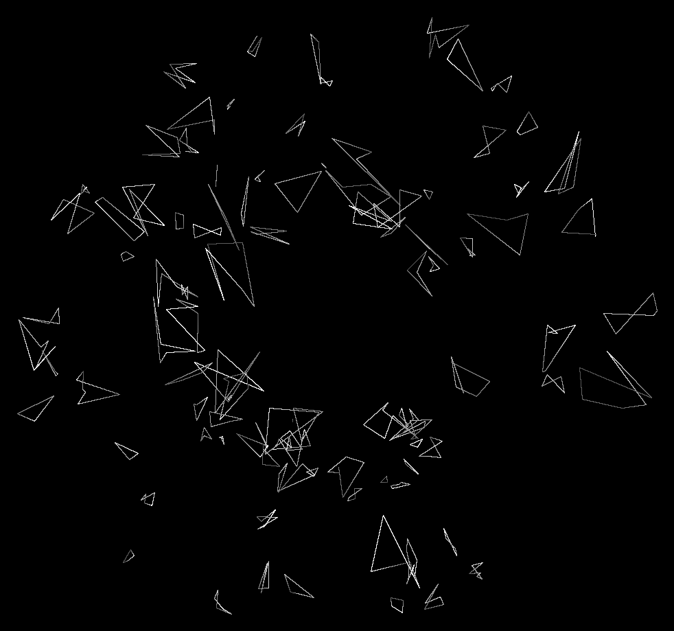
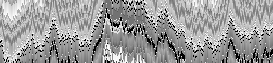

# Convolutional Neural Network for Robot Odometry
Odometry is the use of data from motion sensors to estimate change in position over time. It is used in robotics by some legged or wheeled robots to estimate their position relative to a starting location.

This is a group project for the 10-715 at CMU, and the project has been largely unsuccessful. The course website is: 
https://sites.google.com/site/10715advancedmlintro2017f/lectures

# Environment Simulation
The project was done in simulation and had the initial goal of the possibilit of extension to real-world. The training and testing was both done in 2D environment and 3D environment.

We developed a 2D environment in which the obtructions are polygons and the input images are 1D images. The following is a image of the simulated 2D world. 

And the following is a sequence of frames that are input to our network.  

For the 3D environment, we used the Thor Environment as provided in: 
http://vuchallenge.org/thor.html

# Architecture
We have three models. But the most important part is based on a modified/reduced AlexNet. More details of the AlexNet should be found in the original paper: 
https://papers.nips.cc/paper/4824-imagenet-classification-with-deep-convolutional-neural-networks.pdf

# Loss Function
We want to predict the motion of the camera (veritcal/horizontal rotation, and translational movement).
In the project we found it the most hard to prevent overfitting, and the best model we have is based on a MSE error and a combined L1-L2 regularization. This regularization turned out to be effective at reducing overfitting inour model. In the literature this regularization is also called the <a href="https://en.wikipedia.org/wiki/Elastic_net_regularization">Elastic Net loss function</a>.

# To Do
So so much left to do so I will not list them :>
